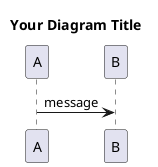

# PlantUML Configuration for Cursor IDE

This workspace is configured for optimal PlantUML development with proper Java integration.

## ✅ **Current Configuration**

### **Java Setup**
- **Version**: OpenJDK 24.0.2 (Homebrew)
- **Location**: `/usr/local/opt/openjdk/bin/java`
- **JAVA_HOME**: `/usr/local/opt/openjdk`

### **PlantUML Setup**
- **Version**: PlantUML 1.2025.4
- **Location**: `/usr/local/bin/plantuml`
- **Graphviz**: 13.1.1 (integrated)

### **Cursor IDE Extensions**
- **PlantUML Extension**: `jebbs.plantuml` (recommended in extensions.json)

## 🚀 **Features Enabled**

### **1. Live Preview**
- Open any `.puml` file in Cursor
- Press `Ctrl+Shift+P` (or `Cmd+Shift+P` on Mac)
- Type "PlantUML: Preview Current Diagram"
- Preview panel will show live diagram updates

### **2. Auto-Export to SVG**
- SVGs are automatically generated in `svg/` directories
- Export format set to SVG by default
- Auto-update on file changes enabled

### **3. Integrated Terminal Commands**
- **Generate all SVGs**: `./scripts/generate-svgs.sh`
- **Test single file**: `plantuml -tsvg filename.puml`
- **Preview in browser**: Use PlantUML server integration

## 📁 **Directory Structure**
```
components/
├── ComponentName/v1.0/src/
│   ├── puml/           # PlantUML source files
│   │   ├── diagram1.puml
│   │   └── diagram2.puml
│   └── svg/            # Generated SVG files
│       ├── diagram1.svg
│       └── diagram2.svg
```

## 🔧 **Configuration Files**

### **.vscode/settings.json**
```json
{
  "plantuml.java": "/usr/local/opt/openjdk/bin/java",
  "plantuml.jar": "/usr/local/bin/plantuml", 
  "plantuml.previewAutoUpdate": true,
  "plantuml.exportOutDir": "./svg",
  "plantuml.exportFormat": "svg"
}
```

### **.envrc** (Environment Variables)
```bash
export JAVA_HOME=/usr/local/opt/openjdk
export PATH="$JAVA_HOME/bin:$PATH"
export PLANTUML_LIMIT_SIZE=8192
```

## 🎯 **Quick Start Guide**

### **1. Create a New Diagram**
```bash
# Create new .puml file
touch components/YourComponent/v1.0/src/puml/YourDiagram.puml
```

### **2. Basic PlantUML Template**


### **3. Generate SVG**
```bash
# Method 1: Use automated script
./scripts/generate-svgs.sh

# Method 2: Manual generation
cd components/YourComponent/v1.0/src/puml
plantuml -tsvg -o ../svg *.puml
```

### **4. Embed in README**
```markdown

```

## 🛠️ **Troubleshooting**

### **Issue: Preview Not Working**
```bash
# Check Java installation
java -version

# Check PlantUML
plantuml -version

# Restart Cursor IDE
```

### **Issue: SVG Export Fails**
```bash
# Check permissions
ls -la components/*/v1.0/src/svg/

# Recreate directories
mkdir -p components/YourComponent/v1.0/src/svg
```

### **Issue: Java Not Found**
```bash
# Set JAVA_HOME in your shell profile
echo 'export JAVA_HOME=/usr/local/opt/openjdk' >> ~/.zshrc
echo 'export PATH="$JAVA_HOME/bin:$PATH"' >> ~/.zshrc
source ~/.zshrc
```

## 🎨 **Advanced Features**

### **1. Color Themes**
```plantuml
!define PRIMARY_COLOR #E3F2FD
!define SECONDARY_COLOR #E8F5E8

class MyClass <<PRIMARY_COLOR>> {
    +method(): void
}
```

### **2. Include Files**
```plantuml
!include common-styles.puml
!include standard-components.puml
```

### **3. Batch Processing**
```bash
# Process all PUML files in workspace
find . -name "*.puml" -exec plantuml -tsvg {} \;
```

## 📊 **Current Workspace Diagrams**

- **Web4Requirement**: Architecture + Overview Generation
- **Web4Test**: Core Architecture + Vitest Integration  
- **GitScrumProject**: CLI Architecture + Template Release

All diagrams are automatically embedded in their respective README files.

---

**Configuration Status**: ✅ **READY FOR DEVELOPMENT**

**Last Updated**: $(date)
**Java**: OpenJDK 24.0.2
**PlantUML**: 1.2025.4
**Graphviz**: 13.1.1
