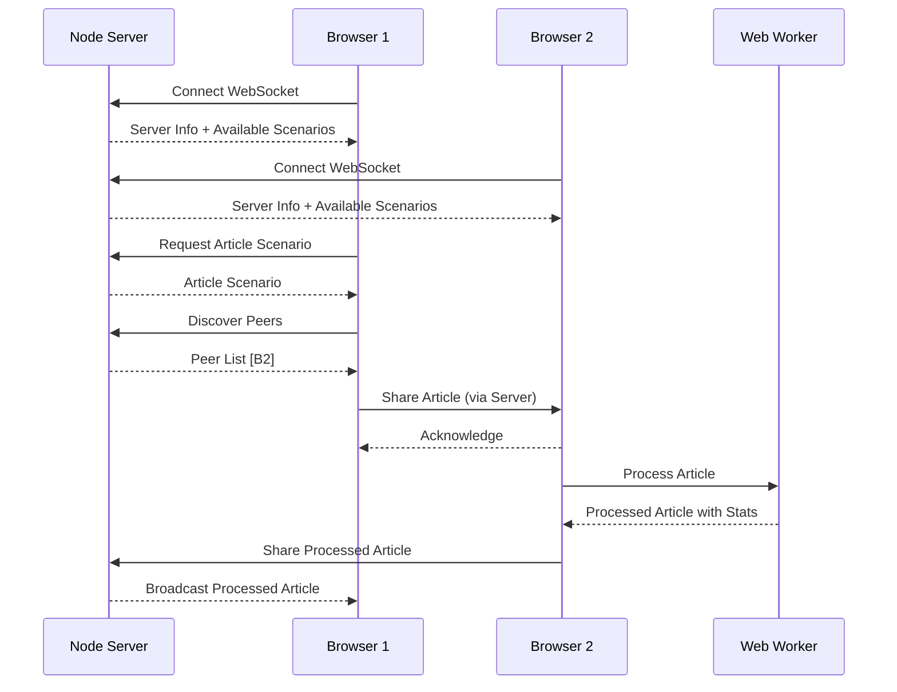

# ONCE Multi-Environment Demo

This demo shows how ONCE kernels running in different environments can discover each other and exchange scenarios, demonstrating the early v1.0 vision of Web4Articles.

## Architecture

```
┌─────────────────┐     ┌─────────────────┐     ┌─────────────────┐
│  Node.js Server │     │ Browser Client  │     │   Web Worker    │
│                 │◄───►│                 │◄───►│                 │
│  ONCE Kernel    │     │  ONCE Kernel    │     │  ONCE Kernel    │
│  (Server Mode)  │     │  (Client Mode)  │     │  (Worker Mode)  │
└─────────────────┘     └─────────────────┘     └─────────────────┘
         ▲                       ▲                       ▲
         │                       │                       │
         └───────────────────────┴───────────────────────┘
                    WebSocket / WebRTC P2P
```

## Demo Scenarios

### 1. Basic Discovery and Handover
- Start Node.js server with sample scenarios
- Browser clients connect and discover available scenarios
- Clients request specific scenarios (user, article, task)
- Server hands over scenarios to clients

### 2. Peer-to-Peer Scenario Exchange
- Multiple browser clients connect to server
- Clients discover each other through server
- Direct P2P scenario exchange between clients
- Collaborative editing of shared scenarios

### 3. Worker Processing Pipeline
- Browser receives scenarios from server
- Hands off heavy processing to Web Worker
- Worker processes scenarios in parallel
- Results sent back through the chain

### 4. Multi-Node Mesh Network
- Multiple Node.js servers form a mesh
- Clients can connect to any server
- Scenarios replicate across the mesh
- Automatic failover and load balancing

## Running the Demo

### Step 1: Start the Node.js Server

```bash
cd examples/node-server
npm install
npm start
```

The server will start on http://localhost:8080

### Step 2: Open Browser Clients

Open multiple browser windows/tabs with:
```
examples/browser-client/index.html
```

Connect each client to the server using the WebSocket URL.

### Step 3: Test Scenario Exchange

1. **Request Scenarios**: Click buttons to request different scenario types from the server
2. **Create & Share**: Create new scenarios in the browser and share with peers
3. **Discover Peers**: See other connected clients and their capabilities

### Step 4: Test Web Worker Processing

Open the Web Worker example:
```
examples/web-worker/index.html
```

1. Initialize the worker
2. Process individual scenarios or batches
3. Run heavy computations in parallel

## Scenario Flow Example



## Key Concepts Demonstrated

### 1. Environment Detection
Each ONCE kernel detects its runtime environment and adapts capabilities:
- Node.js: File system, network server, child processes
- Browser: DOM, localStorage, IndexedDB
- Worker: Parallel processing, no DOM access

### 2. Scenario Structure (from Sprint 22)
All scenarios follow the three-attribute structure:
```javascript
{
    IOR: "type:uuid",           // Internet Object Reference
    owner: "user-id",           // Owner identifier
    model: { /* data */ }       // Actual object data
}
```

### 3. P2P Communication Patterns
- **Discovery**: Kernels announce themselves and capabilities
- **Request/Response**: Direct scenario requests
- **Broadcast**: Share scenarios with all peers
- **Mesh Networking**: Multi-hop scenario routing

### 4. Web4 Principles
- **Empty Constructors**: All objects created without parameters
- **Scenario Initialization**: State loaded from scenarios
- **Universal Deployment**: Same code runs everywhere
- **Hibernate/Restore**: Complete state preservation

## Extending the Demo

### Add New Scenario Types
1. Define new scenario in `shared/sample-scenarios.ts`
2. Add handler in server's `getScenarioByType()`
3. Add UI in browser client

### Add New Processing
1. Extend worker's `processScenarioInternal()`
2. Add new computation types
3. Create specialized processors

### Add Service Worker
1. Create `service-worker/sw.ts`
2. Implement offline scenario caching
3. Background sync for scenarios

## Troubleshooting

- **Connection Failed**: Check server is running on correct port
- **No Peers Found**: Ensure multiple clients are connected
- **Worker Error**: Check browser console for module loading issues
- **WebRTC Issues**: May need STUN/TURN server for remote peers

## Next Steps

This demo provides the foundation for:
- Collaborative article editing
- Distributed requirement management
- P2P test scenario sharing
- Decentralized component discovery

The ONCE kernel enables the Web4 vision where all objects can be discovered, shared, and processed across any environment seamlessly.