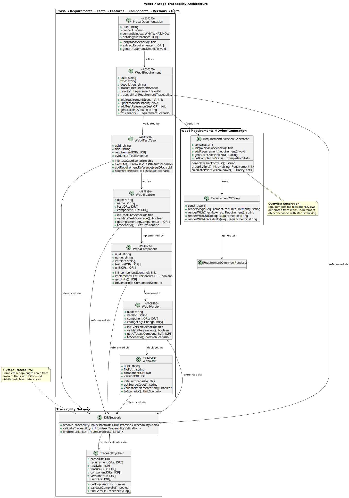
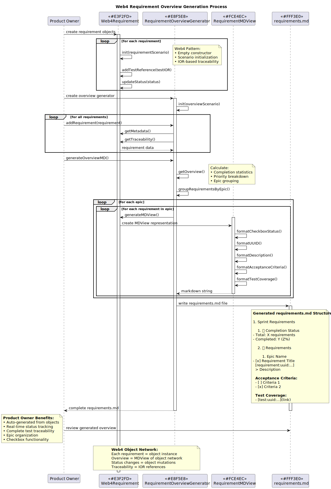

# Web4Requirement Component

**Version:** v1.0  
**Purpose:** Web4-native requirement tracking and overview generation component  
**Category:** Requirements Management & Traceability Component  

## Component Architecture



### Layer Structure (Web4 5-Layer)
- **Layer 1**: Infrastructure - File system, Git integration, UUID generation
- **Layer 2**: Implementation - Requirement logic, status management, MDView generation  
- **Layer 3**: Interface - Requirement interface contracts, TestSuite integration
- **Layer 4**: Controller - Orchestration and business logic for requirement operations
- **Layer 5**: View - MDView generation, requirement list rendering

### Web4 Principles
- **Empty Constructor**: `constructor() {}`
- **Scenario Initialization**: `init(scenario: RequirementScenario): this`
- **Hibernation Capable**: Complete state serialization via scenarios
- **IOR References**: Network-addressable requirement and test references

## Usage

### Overview Generation Process



### Basic Usage

```typescript
import { Web4Requirement } from '@web4x/components/Web4Requirement';

const requirement = new Web4Requirement();
await requirement.init(requirementScenario);
const overviewMD = await requirement.generateOverview();
```

## Purpose
Manage Web4 requirements as objects with status tracking, test traceability, and MDView overview generation. Bridge between requirement objects and requirements.md overview files.
