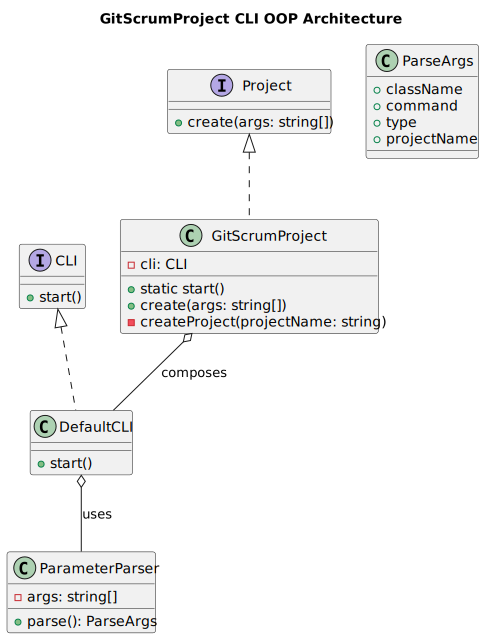
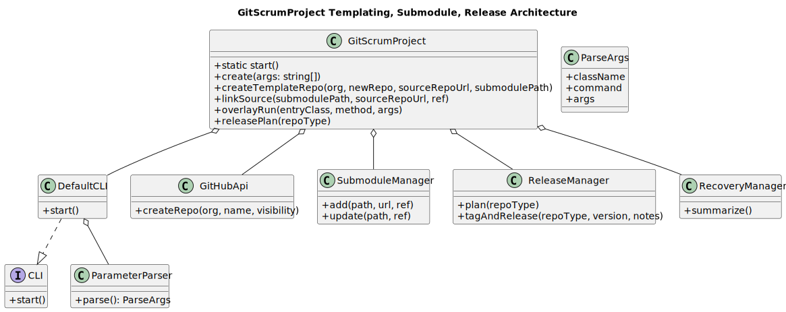

# GitScrumProject User Guide

## Overview

GitScrumProject is a CLI tool that creates new GitHub repositories from this project as a template, referencing the application source as a git submodule rather than copying sources. This dual-repo pattern provides:

- **Separation of concerns**: Project-specific content (docs, issues, wiki) separate from shared source code
- **Version control**: Source code can be versioned independently across multiple projects
- **Efficient updates**: Pull latest source updates without manual file copying
- **Clean project structure**: Each project maintains its own Scrum artifacts while sharing core functionality

### Architecture Diagram



### Template and Release Flow



## Prerequisites

- Node.js 18+ LTS
- Git installed and configured
- GitHub CLI (`gh`) installed and authenticated
- Write access to target GitHub organization

## Installation

The GitScrumProject tool is included as a component in the Web4Articles project. To use it:

```bash
# From project root
npm install

# Run via the component entry point
node --loader ts-node/esm components/GitScrumProject/v1.0/src/ts/layer2/GitScrumProject.ts
```

## Usage

### Create a New Template Repository

Creates a new GitHub repository with this project's structure and links the source as a submodule:

```bash
GitScrumProject createTemplateRepo <org> <newRepo> <sourceRepoUrl> <submodulePath>
```

**Parameters:**
- `org`: GitHub organization name
- `newRepo`: Name for the new repository
- `sourceRepoUrl`: URL of the source repository to link as submodule
- `submodulePath`: Path where the submodule will be placed (typically `sources`)

**Example:**
```bash
GitScrumProject createTemplateRepo Cerulean-Circle-GmbH TLA.scrum.pmo https://github.com/Cerulean-Circle-GmbH/TLA sources
```

This command:
1. Creates a new repository `TLA.scrum.pmo` in the specified organization
2. Copies the project structure (Scrum artifacts, docs, CI/CD)
3. Adds the TLA repository as a submodule at `sources/`
4. Sets up GitHub workflows for the wrapper repository

### Link Source Repository

Links or updates a source repository as a submodule:

```bash
GitScrumProject linkSource <submodulePath> <sourceRepoUrl> <ref>
```

**Parameters:**
- `submodulePath`: Path for the submodule (e.g., `sources`)
- `sourceRepoUrl`: URL of the source repository
- `ref`: Git reference to track (branch, tag, or commit)

**Example:**
```bash
GitScrumProject linkSource sources https://github.com/Cerulean-Circle-GmbH/TLA main
```

### Generate Release Plan

Generates a release plan for either the wrapper or source repository:

```bash
GitScrumProject releasePlan <repoType>
```

**Parameters:**
- `repoType`: Either `wrapper` or `source`

**Example:**
```bash
GitScrumProject releasePlan wrapper
```

### Run Commands from Wrapper into Source

Execute commands that overlay the wrapper context onto the source submodule:

```bash
GitScrumProject overlayRun <entryClass> <method> [args...]
```

**Parameters:**
- `entryClass`: The class to invoke in the source
- `method`: The method to call
- `args`: Additional arguments to pass

**Example:**
```bash
GitScrumProject overlayRun TSsh help
```

## Dual-Repository Pattern

### Structure

After creating a template repository, you'll have:

```
TLA.scrum.pmo/              # Wrapper repository
├── scrum.pmo/              # Scrum artifacts
├── docs/                   # Project documentation
├── .github/workflows/      # CI/CD configuration
├── sources/                # Submodule (points to TLA repo)
│   ├── src/               # Source code
│   ├── tests/             # Tests
│   └── package.json       # Dependencies
└── README.md              # Project-specific README
```

### Working with Submodules

**Initial clone:**
```bash
git clone --recursive https://github.com/org/TLA.scrum.pmo
```

**Update submodule to latest:**
```bash
git submodule update --remote --merge
```

**Change submodule branch:**
```bash
cd sources
git checkout feature-branch
cd ..
git add sources
git commit -m "Update sources to feature-branch"
```

## Release and Recovery Process

### Wrapper Repository Release

1. Update documentation and Scrum artifacts
2. Commit all changes
3. Run release plan: `GitScrumProject releasePlan wrapper`
4. Tag the release: `git tag -a v1.0.0 -m "Release v1.0.0"`
5. Push with tags: `git push origin main --tags`

### Source Repository Updates

1. Pull latest changes in source repository
2. In wrapper repo: `git submodule update --remote`
3. Test integration
4. Commit submodule update
5. Follow wrapper release process

### Recovery Process

If context is lost or repository needs recovery:

1. Clone with submodules: `git clone --recursive <repo-url>`
2. Check submodule status: `git submodule status`
3. If submodule is detached: 
   ```bash
   cd sources
   git checkout main
   git pull origin main
   ```
4. Verify with: `GitScrumProject overlayRun TSsh help`

## Troubleshooting

### Submodule Shows Detached HEAD

This is normal after `git submodule update`. To track a branch:
```bash
cd sources
git checkout main
git branch --set-upstream-to=origin/main
```

### Authentication Issues

Ensure GitHub CLI is authenticated:
```bash
gh auth status
gh auth login
```

### CI/CD Secrets

For GitHub Actions to access the submodule:
1. Create a Personal Access Token with `repo` scope
2. Add as secret `SUBMODULE_TOKEN` in repository settings
3. Workflows will use this token for submodule operations

### Push Permission Denied

If HTTPS push fails, the tool automatically falls back to SSH. Ensure:
1. SSH keys are configured: `ssh -T git@github.com`
2. Repository remote uses SSH: `git remote set-url origin git@github.com:org/repo.git`

## FAQ

**Q: Can I modify source code in the wrapper repository?**
A: No, source modifications should be made in the source repository and then updated in wrapper repos.

**Q: How do I add project-specific features?**
A: Add them to the wrapper repository outside the `sources/` directory. Use the overlay pattern to integrate.

**Q: Can multiple wrapper repos share the same source?**
A: Yes, this is the primary benefit. Each wrapper can track different versions/branches of the source.

**Q: How do I handle source dependencies?**
A: Dependencies are managed in the source repository's `package.json`. Run `npm install` from the wrapper root.

## Best Practices

1. **Regular Updates**: Schedule regular source updates to avoid large integration efforts
2. **Branch Strategy**: Use consistent branch names between wrapper and source when possible
3. **Documentation**: Keep wrapper-specific documentation in the wrapper repo
4. **Testing**: Always test after submodule updates before committing
5. **Version Pinning**: For production, pin submodules to specific tags/commits

## Related Documentation

- [Components Architecture](../architecture/components.md)
- [Branching Strategy](../branching-strategy.md)
- [Release Dev Strategy](../release-dev-strategy.md)