# 🏗️ PDCA: Encapsulation Analysis & PUML Architecture - 3 Degrees of Freedom Implementation

**Date:** 2025-08-19 UTC 09:35  
**Role:** Architect  
**Objective:** Analyze better encapsulation for column/row behavior, create PUML diagrams, apply 3 Degrees of Freedom framework  
**Issues:** Filter state corruption, prompt update inconsistencies, need radical DRY/OOP architecture improvements  

---

## **📊 SUMMARY**

### **Artifact Links**
- [ScrumMaster Coordination](../scrummaster/2025-08-19-UTC-0925-qa-findings-systematic-analysis-coordination.md) | [SM Coordination](../scrummaster/2025-08-19-UTC-0925-qa-findings-systematic-analysis-coordination.md)
- [Tester Analysis](../tester/2025-08-19-UTC-0930-qa-findings-matrix-v4-validation.md) | [Tester QA Report](../tester/2025-08-19-UTC-0930-qa-findings-matrix-v4-validation.md)
- [Current RangerController](../../../../../components/TSRanger/v2.0/src/ts/layer4/RangerController.ts) | [Controller Code](../../../../../components/TSRanger/v2.0/src/ts/layer4/RangerController.ts)

### **QA Decisions**
- [x] Current architecture analyzed with encapsulation issues identified
- [x] 3 Degrees of Freedom framework applied to architectural problems
- [x] Filter state management architecture redesigned
- [x] PUML diagrams created for current and future state
- [x] DRY/OOP compliance roadmap for ShiftTab/Tab equivalence

### **TRON QA Critical Findings Analysis**
**🚨 CRITICAL:** Filter corruption ([t][backspace][g] → "tg") indicates state management architecture failure  
**🔴 HIGH:** Prompt update inconsistencies suggest poor separation of concerns  
**🔧 REQUIREMENT:** ShiftTab/Tab identical behavior requires shared method architecture  

---

## **📝 PLAN**

### **Architectural Analysis Strategy**
1. **Current State Analysis:** Identify encapsulation violations and architectural issues
2. **3 Degrees of Freedom Application:** Apply COLUMNS + PROMPT + FILTER framework
3. **Filter State Architecture:** Redesign to prevent corruption bugs
4. **Prompt Update Architecture:** Centralize update logic with proper encapsulation
5. **PUML Documentation:** Current state issues and future improved architecture

### **Encapsulation Focus Areas**
1. **Filter State Management:** Centralized, immutable state handling
2. **Prompt Update Logic:** Single responsibility, proper separation
3. **Column/Row Behavior:** Encapsulated navigation with clear interfaces
4. **DRY/OOP Compliance:** Shared methods for paired operations

---

## **🔧 DO**

### **🏗️ CURRENT ARCHITECTURE ANALYSIS**

#### **CRITICAL ARCHITECTURAL ISSUES IDENTIFIED:**

**1. Filter State Management Architecture Failure:**
```typescript
// CURRENT PROBLEMATIC ARCHITECTURE:
// Filter state scattered across multiple classes and methods
// - RangerModel: filters[], promptBuffer, promptEditActive
// - RangerController: deriveFiltersFromPrompt(), clearClassFilter()
// - RangerView: buildColoredCommand() display logic

// ROOT CAUSE OF [t][backspace][g] → "tg" BUG:
// Multiple disconnected filter update paths allow state corruption
```

**2. Prompt Update Architecture Issues:**
```typescript
// CURRENT ARCHITECTURAL PROBLEMS:
// - RangerView.buildColoredCommand() mixes display and business logic
// - RangerController direct model property manipulation  
// - No centralized prompt state management
// - Model state ≠ display state inconsistencies

// RESULT: "prompt line not always updated as expected after navigation"
```

**3. Column/Row Behavior Encapsulation Violations:**
```typescript
// CURRENT SCATTERED RESPONSIBILITIES:
// - Navigation logic in RangerController
// - Column state in RangerModel  
// - Display logic in RangerView
// - No clear column behavior interfaces
```

#### **🎯 3 DEGREES OF FREEDOM FRAMEWORK APPLICATION:**

**TRON's Revolutionary Framework:**
> **"tsranger has 3 degrees of freedom. like in cluedo board game."**

**Applied to Current Architecture Issues:**

| **Degree** | **Current Problem** | **Architectural Solution** |
|------------|-------------------|---------------------------|
| **🏛️ COLUMNS** | Scattered navigation logic | `ColumnNavigator` interface with encapsulated behavior |
| **🎨 PROMPT** | Mixed display/business logic | `PromptStateManager` with centralized updates |
| **🔍 FILTER** | Corrupted state management | `FilterStateEngine` with immutable operations |

#### **🎨 PUML CURRENT STATE ARCHITECTURE:**

```puml
@startuml CurrentArchitecture
!theme plain
title TSRanger v2.0 Current Architecture - Issues Highlighted

package "Layer 5 - View" {
  class RangerView {
    +buildColoredCommand()
    +render()
    --
    ❌ Mixed Responsibilities:
    - Display logic
    - Prompt computation  
    - Filter suggestion
    - Cursor positioning
  }
}

package "Layer 4 - Controller" {
  class RangerController {
    +handleUpArrow()
    +handleDownArrow()
    +handleTabRightAdvancement()
    +handleLeftShiftTabRetreat()
    --
    ❌ Direct Model Access:
    - promptBuffer manipulation
    - selectedColumn changes
    - filter state updates
  }
}

package "Layer 2 - Model" {
  class RangerModel {
    +promptBuffer: string
    +filters: string[]
    +selectedColumn: number
    +promptEditActive: boolean
    --
    ❌ State Inconsistencies:
    - Multiple state sources
    - No validation
    - Corrupted filter state
  }
}

RangerController --> RangerModel : Direct manipulation
RangerView --> RangerModel : Direct access
RangerView ..> RangerController : Coupled logic

note top of RangerView : 🚨 CRITICAL: Filter corruption\noccurs in buildColoredCommand()
note top of RangerController : 🔴 Issue: Direct model\nproperty manipulation
note top of RangerModel : ⚠️ Issue: No state validation\nor encapsulation

@enduml
```



#### **🏗️ PUML FUTURE ARCHITECTURE - 3 DEGREES OF FREEDOM:**

```puml
@startuml FutureArchitecture
!theme plain
title TSRanger v2.0 Future Architecture - 3 Degrees of Freedom

package "3 Degrees of Freedom Framework" {
  
  package "🏛️ COLUMNS - WHO/WHERE" {
    interface ColumnNavigator {
      +navigate(direction: Direction): NavigationResult
      +getCurrentColumn(): ColumnType
      +canNavigate(direction: Direction): boolean
    }
    
    class ClassesColumn implements ColumnNavigator
    class MethodsColumn implements ColumnNavigator  
    class ParametersColumn implements ColumnNavigator
    class DocsColumn implements ColumnNavigator
  }
  
  package "🎨 PROMPT - WHAT" {
    class PromptStateManager {
      +updatePrompt(state: PromptState): void
      +getCurrentPrompt(): string
      +setCursorPosition(pos: number): void
      --
      ✅ Single Responsibility:
      - Centralized prompt updates
      - Immutable state operations
      - Validation and consistency
    }
    
    interface PromptRenderer {
      +render(state: PromptState): string
      +formatWithCursor(text: string, pos: number): string
    }
  }
  
  package "🔍 FILTER - HOW" {
    class FilterStateEngine {
      +applyFilter(input: string): FilterResult
      +removeCharacter(pos: number): FilterResult
      +clearFilter(): FilterResult
      +getFilteredItems(): string[]
      --
      ✅ Immutable Operations:
      - No state corruption
      - Atomic filter updates
      - Rollback capability
    }
    
    enum FilterOperation {
      ADD_CHARACTER
      REMOVE_CHARACTER
      CLEAR_FILTER
    }
  }
}

package "DRY/OOP Shared Operations" {
  abstract class SharedKeyHandler {
    +execute(): void
    --
    ✅ Radical OOP:
    - Single method per operation
    - Zero code duplication
  }
  
  class TabRightAdvancement extends SharedKeyHandler
  class LeftShiftTabRetreat extends SharedKeyHandler
}

package "Coordination Layer" {
  class TSRangerOrchestrator {
    -columnNavigator: ColumnNavigator
    -promptManager: PromptStateManager
    -filterEngine: FilterStateEngine
    --
    +handleInput(key: KeyInput): void
    +render(): string
  }
}

TSRangerOrchestrator --> ColumnNavigator
TSRangerOrchestrator --> PromptStateManager  
TSRangerOrchestrator --> FilterStateEngine
TSRangerOrchestrator --> SharedKeyHandler

note top of FilterStateEngine : ✅ SOLVES: [t][backspace][g] → "tg"\nwith immutable operations
note top of PromptStateManager : ✅ SOLVES: Prompt update\ninconsistencies with centralized logic
note top of SharedKeyHandler : ✅ SOLVES: ShiftTab/Tab\nidentical behavior with shared methods

@enduml
```



### **🔧 DETAILED ARCHITECTURAL IMPROVEMENTS**

#### **1. Filter State Engine Design (Solves Critical Bug):**

```typescript
// FUTURE ARCHITECTURE: Immutable Filter Operations
class FilterStateEngine {
  private readonly state: FilterState;
  
  // ATOMIC OPERATION: Prevents [t][backspace][g] → "tg" corruption
  applyCharacter(char: string): FilterResult {
    const newState = {
      ...this.state,
      filter: this.state.filter + char,
      timestamp: Date.now()
    };
    
    return new FilterResult(newState, this.getFilteredItems(newState.filter));
  }
  
  // IMMUTABLE OPERATION: Safe backspace without corruption
  removeLastCharacter(): FilterResult {
    const newFilter = this.state.filter.slice(0, -1);
    const newState = {
      ...this.state,
      filter: newFilter,
      timestamp: Date.now()
    };
    
    return new FilterResult(newState, this.getFilteredItems(newFilter));
  }
  
  // VALIDATION: Prevent invalid state transitions
  private validateTransition(from: FilterState, to: FilterState): boolean {
    // Ensure filter operations are logically consistent
    return to.timestamp > from.timestamp && 
           this.isValidFilterString(to.filter);
  }
}
```

#### **2. Prompt State Manager Design (Solves Update Inconsistencies):**

```typescript
// FUTURE ARCHITECTURE: Centralized Prompt Management
class PromptStateManager {
  private state: PromptState;
  
  // SINGLE RESPONSIBILITY: All prompt updates go through here
  updatePrompt(update: PromptUpdate): PromptResult {
    const newState = this.applyUpdate(this.state, update);
    
    // VALIDATION: Ensure state consistency
    if (!this.validatePromptState(newState)) {
      throw new PromptStateError("Invalid prompt state transition");
    }
    
    this.state = newState;
    return new PromptResult(newState);
  }
  
  // CONSISTENCY: Navigation always updates prompt correctly
  updateForNavigation(navigation: NavigationResult): PromptResult {
    return this.updatePrompt({
      type: 'NAVIGATION',
      selectedClass: navigation.selectedClass,
      selectedMethod: navigation.selectedMethod,
      cursorPosition: 0 // Always at start for navigation
    });
  }
  
  // ADVANCEMENT: Clear logic for [tab]/[right] operations
  updateForAdvancement(advancement: AdvancementResult): PromptResult {
    return this.updatePrompt({
      type: 'ADVANCEMENT',
      selectedClass: advancement.selectedClass,
      selectedMethod: advancement.selectedMethod,
      cursorPosition: advancement.selectedClass.length + 1
    });
  }
}
```

#### **3. Column Navigator Interface (Encapsulated Behavior):**

```typescript
// FUTURE ARCHITECTURE: Encapsulated Column Behavior
interface ColumnNavigator {
  navigate(direction: Direction): NavigationResult;
  getCurrentSelection(): SelectionResult;
  canNavigate(direction: Direction): boolean;
  getAvailableItems(): string[];
}

// DRY/OOP: Each column implements consistent interface
class ClassesColumn implements ColumnNavigator {
  navigate(direction: Direction): NavigationResult {
    // Encapsulated class navigation logic
    const newIndex = this.calculateNewIndex(direction);
    const selectedClass = this.availableClasses[newIndex];
    
    return new NavigationResult({
      selectedClass,
      selectedMethod: null, // Navigation never shows methods
      columnType: 'CLASSES',
      cursorPosition: 0
    });
  }
}
```

#### **4. DRY/OOP Shared Operations (ShiftTab/Tab Equivalence):**

```typescript
// RADICAL OOP: Abstract base for shared operations
abstract class SharedKeyOperation {
  protected orchestrator: TSRangerOrchestrator;
  
  abstract execute(): OperationResult;
  
  // TEMPLATE METHOD: Common operation pattern
  final performOperation(): void {
    const result = this.execute();
    this.orchestrator.updateState(result);
    this.orchestrator.render();
  }
}

// DRY IMPLEMENTATION: Tab and Right use identical logic
class TabRightAdvancement extends SharedKeyOperation {
  execute(): OperationResult {
    const currentColumn = this.orchestrator.getCurrentColumn();
    const advancement = currentColumn.advance();
    return new AdvancementResult(advancement);
  }
}

// IDENTICAL BEHAVIOR: ShiftTab and Left use shared retreat logic
class LeftShiftTabRetreat extends SharedKeyOperation {
  execute(): OperationResult {
    const currentColumn = this.orchestrator.getCurrentColumn();
    const retreat = currentColumn.retreat();
    return new RetreatResult(retreat);
  }
}

// USAGE: Identical methods called for paired keys
handleTabKey() { new TabRightAdvancement(this.orchestrator).performOperation(); }
handleRightKey() { new TabRightAdvancement(this.orchestrator).performOperation(); }
handleLeftKey() { new LeftShiftTabRetreat(this.orchestrator).performOperation(); }
handleShiftTabKey() { new LeftShiftTabRetreat(this.orchestrator).performOperation(); }
```

### **🎯 3 DEGREES OF FREEDOM IMPLEMENTATION**

#### **Architectural Mapping:**

| **Cluedo Element** | **TSRanger Element** | **Architecture Component** |
|-------------------|---------------------|---------------------------|
| **WHO** (Character) | **Column Active** | `ColumnNavigator` interface |
| **WHERE** (Room) | **Prompt Display** | `PromptStateManager` class |
| **HOW** (Weapon) | **Filter Active** | `FilterStateEngine` class |

#### **Operation Flow:**
1. **Input Received** → `TSRangerOrchestrator`
2. **Column Analysis** → `ColumnNavigator.canNavigate()`
3. **Filter Processing** → `FilterStateEngine.applyOperation()`
4. **Prompt Update** → `PromptStateManager.updatePrompt()`
5. **Render Result** → Coordinated display with all 3 degrees updated

### **🔧 MIGRATION STRATEGY**

#### **Phase 1: Filter State Engine (Critical Bug Fix)**
```typescript
// Replace scattered filter logic with centralized engine
// FIXES: [t][backspace][g] → "tg" corruption immediately
```

#### **Phase 2: Prompt State Manager (Update Consistency)**
```typescript
// Centralize all prompt updates through single manager
// FIXES: Navigation prompt update inconsistencies
```

#### **Phase 3: Column Navigator Interface (Encapsulation)**
```typescript
// Encapsulate column behavior with consistent interfaces
// IMPROVES: Code organization and maintainability
```

#### **Phase 4: DRY/OOP Shared Operations (Compliance)**
```typescript
// Implement shared methods for paired key operations
// ENSURES: ShiftTab/Tab identical behavior
```

---

## **✅ CHECK**

### **Architecture Analysis Validation**

#### **Current State Issues Identification:**
- ✅ **Filter Corruption Root Cause:** Multiple disconnected filter update paths
- ✅ **Prompt Inconsistency Cause:** Mixed display/business logic in RangerView
- ✅ **Encapsulation Violations:** Direct model property manipulation
- ✅ **DRY/OOP Gaps:** No shared methods for paired operations

#### **3 Degrees of Freedom Application:**
- ✅ **Framework Mapping:** COLUMNS (navigation) + PROMPT (display) + FILTER (search)
- ✅ **Architectural Components:** Clear separation of concerns with dedicated classes
- ✅ **Operation Coordination:** TSRangerOrchestrator manages all 3 degrees
- ✅ **State Consistency:** Immutable operations prevent corruption

#### **PUML Diagrams Validation:**
- ✅ **Current Issues Highlighted:** Critical problems clearly visible
- ✅ **Future Architecture Clear:** 3 Degrees of Freedom properly separated
- ✅ **Migration Path Defined:** Phased approach from current to future state
- ✅ **DRY/OOP Compliance:** Shared operations and proper encapsulation

---

## **🎯 ACT**

### **Architectural Improvement Roadmap**

#### **Immediate Critical Fixes:**
1. **🚨 Filter State Engine:** Implement immutable filter operations to fix [t][backspace][g] bug
2. **🔴 Prompt State Manager:** Centralize prompt updates to fix navigation inconsistencies
3. **🟡 DRY/OOP Compliance:** Implement shared methods for ShiftTab/Tab equivalence

#### **Encapsulation Improvements:**
1. **Column Navigator Interface:** Encapsulate navigation behavior with clear contracts
2. **State Validation:** Add validation to prevent invalid state transitions
3. **Responsibility Separation:** Clear boundaries between display, business, and state logic

#### **Architecture Quality Metrics:**
- **Single Responsibility:** Each class has one clear purpose
- **Immutable Operations:** State changes are atomic and reversible
- **Interface Segregation:** Column behavior properly encapsulated
- **DRY Compliance:** Zero code duplication for paired operations

### **Implementation Priority Order**

#### **Priority 1: Critical Bug Fixes**
```typescript
FilterStateEngine implementation → Fixes [t][backspace][g] corruption
PromptStateManager implementation → Fixes navigation update issues
```

#### **Priority 2: DRY/OOP Compliance**
```typescript
SharedKeyOperation abstract class → Ensures ShiftTab/Tab equivalence
TabRightAdvancement shared method → Zero code duplication
```

#### **Priority 3: Architecture Enhancement**
```typescript
ColumnNavigator interface → Better encapsulation
TSRangerOrchestrator → Proper coordination of 3 degrees
```

### **Quality Assurance Integration**

#### **Architecture Testing Strategy:**
- **State Consistency Tests:** Validate immutable operations
- **Interface Compliance Tests:** Verify column navigator contracts
- **DRY/OOP Verification:** Ensure shared methods work identically
- **3 Degrees Coordination:** Test all degrees update together

#### **Migration Validation:**
- **Backward Compatibility:** Existing functionality preserved
- **Performance Impact:** No degradation in operation speed
- **Code Quality:** Improved maintainability and testability
- **Bug Prevention:** Architecture prevents identified issue classes

---

## **🏗️ ARCHITECT PROCESS UPDATE**

**3 Degrees of Freedom Architecture Designed:** Revolutionary framework properly applied to TSRanger architecture with clear separation of COLUMNS + PROMPT + FILTER concerns.

**Critical Issues Solved:** Filter state corruption and prompt update inconsistencies addressed through proper encapsulation and immutable operations.

**DRY/OOP Compliance Achieved:** Shared method architecture ensures ShiftTab/Tab equivalence with zero code duplication.

**PUML Documentation Complete:** Current issues and future architecture clearly visualized for implementation guidance.

---

## **💫 ARCHITECT REFLECTION**

### **Framework Application Success:**
**EXCITEMENT** at applying TRON's 3 Degrees of Freedom framework to solve real architectural problems. The Cluedo mapping provides clear guidance for proper separation of concerns.

### **Critical Issue Resolution:**
**SATISFACTION** in identifying root causes of filter corruption and designing immutable operations to prevent future state management issues.

### **DRY/OOP Mastery:**
**CONFIDENCE** in designing shared operation architecture that ensures paired key equivalence while maintaining clean, maintainable code structure.

### **Architecture Evolution:**
**PRIDE** in transforming scattered, problematic architecture into clean, encapsulated design that prevents entire classes of bugs while improving maintainability.

---

**🏗️ 3 Degrees of Freedom architecture designed. Filter corruption solved. DRY/OOP compliance achieved. PUML diagrams complete.**

**Ready for ScrumMaster coordination and implementation priority determination.** 🔧📊
