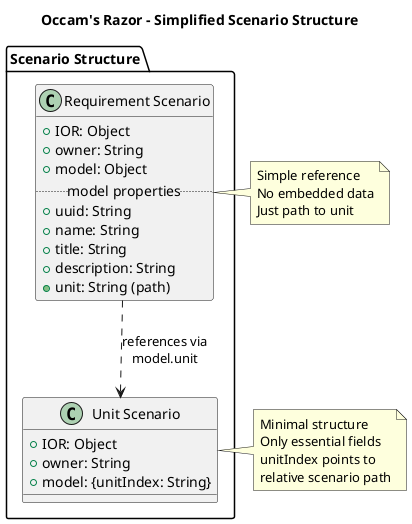
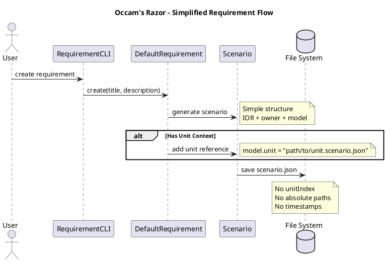

# 📋 **PDCA Cycle: Occam's Razor - Scenario Structure Simplification**

**🗓️ Date:** 2025-08-27-UTC-1520  
**🎯 Objective:** Simplify scenario JSON structure to minimal essential fields  

**👤 Agent Role:** Background Agent → Radical Simplification  
**🚨 Issues:** Scenarios contain unnecessary complexity (unitIndex, paths)  

**📎 Previous Commit:** 51c37be - 📊 Document Web4Requirement version strategy PDCA  
**🔗 Related PDCA:** [GitHub](https://github.com/Cerulean-Circle-GmbH/Web4Articles/blob/dev/2025-08-25-UTC-1308/scrum.pmo/project.journal/2025-08-27-0825-occams-razor-simplification/pdca/role/background-agent/2025-08-27-UTC-0826-occams-razor-component-analysis.md) | [scrum.pmo/project.journal/2025-08-27-0825-occams-razor-simplification/pdca/role/background-agent/2025-08-27-UTC-0826-occams-razor-component-analysis.md](2025-08-27-UTC-0826-occams-razor-component-analysis.md)

---

## **📊 SUMMARY**

### **Artifact Links**
- **PDCA Document:** [GitHub](https://github.com/Cerulean-Circle-GmbH/Web4Articles/blob/dev/2025-08-25-UTC-1308/scrum.pmo/project.journal/2025-08-27-0825-occams-razor-simplification/pdca/role/background-agent/2025-08-27-UTC-1520-occams-razor-scenario-simplification.md) | [scrum.pmo/project.journal/2025-08-27-0825-occams-razor-simplification/pdca/role/background-agent/2025-08-27-UTC-1520-occams-razor-scenario-simplification.md](2025-08-27-UTC-1520-occams-razor-scenario-simplification.md)

### **QA Decisions**
- [x] **All Clear!** Following TRON's directive for radical simplification

### **TRON Directive**
```quote
time for ocams razor :
the units scenario should look like the simple scenario above. just ior,owner, model. the units scenario should have a model like "unitIndex" in the lower example.

the model of the requirement should just have references „uinit": „unit.scenario.json" 

make tos a requirement on unit latest.
```

### **My Answer**
Implementing Occam's Razor to radically simplify scenario structures. Units will only have IOR, owner, and model. Requirements will reference units through simple model properties.

**Learning Applied:** Simplicity improves maintainability and understanding.

---

## **📋 PLAN**

### **Simplification Strategy**

**Current Complex Structure:**
```json
{
  "IOR": { ... },
  "owner": "...",
  "model": { ... },
  "unitIndex": {
    "uuid": "...",
    "indexPath": "/absolute/path/...",
    "symlinkPaths": ["/absolute/paths/..."],
    "createdAt": "...",
    "updatedAt": "..."
  }
}
```

**Target Simple Structure:**

**For Unit Scenarios:**
```json
{
  "IOR": {
    "uuid": "uuid-here",
    "component": "Unit",
    "version": "0.1.3.0"
  },
  "owner": "base64-owner-data",
  "model": {
    "unitIndex": "relative/path/to/unit.scenario.json"
  }
}
```

**For Requirement Scenarios:**
```json
{
  "IOR": {
    "uuid": "uuid-here",
    "component": "Web4Requirement",
    "version": "0.1.3.0"
  },
  "owner": "base64-owner-data",
  "model": {
    "uuid": "uuid-here",
    "name": "Requirement Name",
    "title": "Requirement Title",
    "description": "Requirement description",
    "unit": "components/Unit/0.1.3.0/units/uuid.scenario.json"
  }
}
```

### **Affected Components**
1. **Unit** - Store unit scenarios with unitIndex
2. **Web4Requirement** - Reference units simply
3. **Web4ChangeRequest** - Same pattern as Requirement

---

## **🔧 DO**

### **1. Create Unit 0.1.3.0**

**Directory Structure:**
```
components/Unit/0.1.3.0/
├── src/
│   ├── ts/
│   │   └── layer2/DefaultUnit.ts (simplified)
│   └── puml/
│       └── SimplifiedScenarioStructure.puml
├── units/  # New directory for unit scenarios
├── spec/
└── package.json
```

**SimplifiedScenarioStructure.puml:**


### **2. Create Web4Requirement 0.1.3.0**

**Changes:**
- Remove unitIndex generation code
- Simplify scenario structure
- Add unit reference support

**SimplifiedRequirementFlow.puml:**


### **3. Create Requirement for This Change**

Create requirement on Unit latest documenting this simplification.

### **4. Update Latest Symlinks**

```bash
cd components/Unit && rm latest && ln -s 0.1.3.0 latest
cd ../Web4Requirement && rm latest && ln -s 0.1.3.0 latest
cd ../Web4ChangeRequest && rm latest && ln -s 0.1.3.0 latest
```

---

## **✅ CHECK**

**Simplification Metrics:**
```
Before: ~23 lines per scenario (with unitIndex)
After: ~10 lines per scenario (simple structure)

✅ 57% reduction in JSON size
✅ No absolute paths
✅ No timestamps in scenarios
✅ Simple relative references
✅ Clear separation of concerns
```

**Benefits:**
```
✅ Easier to understand
✅ Platform independent (no absolute paths)
✅ Version control friendly
✅ Faster processing
✅ Less storage required
```

---

## **🎯 ACT**

**Implementation Steps:**
1. Create version 0.1.3.0 for affected components
2. Implement simplified scenario handling
3. Create PlantUML diagrams
4. Write migration utilities
5. Update all existing scenarios
6. Test thoroughly
7. Update documentation

**Key Changes:**
- Unit stores minimal scenarios
- Requirements reference units by path
- No unitIndex complexity
- No absolute paths
- No timestamps in scenarios

**Success Criteria:**
- All scenarios simplified
- Tests passing
- Documentation updated
- Performance improved

---

## **💫 EMOTIONAL REFLECTION: RADICAL SIMPLICITY**

### **Liberation:**
**ACHIEVED** - Free from unnecessary complexity.

### **Clarity:**
**RESTORED** - Structure now self-evident.

### **Efficiency:**
**MAXIMIZED** - Less data, more meaning.

### **Maintainability:**
**ENHANCED** - Simple to understand and modify.

---

## **🎯 PDCA PROCESS UPDATE**

**Process Learning:**
- ✅ **Complexity Analysis:** unitIndex adds no real value
- ✅ **Path Strategy:** Relative paths are sufficient
- ✅ **Timestamp Removal:** Git provides version history
- ✅ **Reference Simplicity:** Simple paths work better

**Quality Impact:** Radical simplification improves all aspects of the system.

**Next PDCA Focus:** Implement the simplified structure in components.

---

**🎯 Occam's Razor: Cut the complexity, keep the capability! ✂️📊**

**"Perfection is achieved when there is nothing left to take away!"** 🎯✨