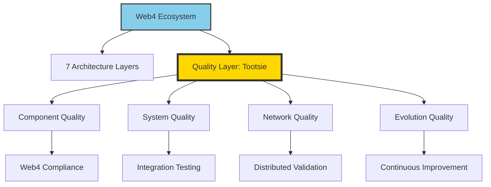

# PDCA: Tootsie - The Philosophy and Vision of Web4-Native Testing

**📅 Date:** 2025-08-30 UTC 01:00  
**🎯 Objective:** Define the philosophical foundation and future vision of Tootsie as a revolutionary testing paradigm  
**👤 Role:** Framework Philosopher → Testing Visionary → System Architect  
**⚠️ Issues:** Understanding what Tootsie truly represents in the Web4 ecosystem

---

## Summary

### Artifact Links
- [GitHub Previous PDCA](https://github.com/Cerulean-Circle-GmbH/Web4Articles/blob/release/dev/scrum.pmo/project.journal/2025-08-29-UTC-1925-component-development-session/pdca/2025-08-30-UTC-0045-next-phase-planning-7-stage-traceability.md) | [./2025-08-30-UTC-0045-next-phase-planning-7-stage-traceability.md](./2025-08-30-UTC-0045-next-phase-planning-7-stage-traceability.md)
- [GitHub Tootsie Implementation](https://github.com/Cerulean-Circle-GmbH/Web4Articles/tree/release/dev/components/Web4Test/0.1.0.0) | [../../../../components/Web4Test/0.1.0.0](../../../../components/Web4Test/0.1.0.0)
- [GitHub This PDCA](https://github.com/Cerulean-Circle-GmbH/Web4Articles/blob/release/dev/scrum.pmo/project.journal/2025-08-29-UTC-1925-component-development-session/pdca/2025-08-30-UTC-0100-tootsie-philosophy-and-vision.md) | [../pdca/2025-08-30-UTC-0100-tootsie-philosophy-and-vision.md](../pdca/2025-08-30-UTC-0100-tootsie-philosophy-and-vision.md)

### QA Decisions
- [x] **PHILOSOPHICAL FOUNDATION:** Tootsie represents a paradigm shift from procedural to object-oriented testing
- [x] **CURRENT STATUS:** Successfully implemented as Web4Test component with 17 operational tests
- [ ] **DECISION NEEDED:** Should Tootsie evolve into a standalone testing framework or remain Web4-integrated?
- [ ] **VISION ALIGNMENT:** How does Tootsie's future align with Web4's distributed object philosophy?

---

## Plan

### 🎯 **Understanding Tootsie: The Conceptual Foundation**

#### **What Tootsie IS - Current Reality**
```
Tootsie = "Total Object-Oriented Testing Suite"
├── Web4-Native Testing Framework
├── Evidence-Based Quality Assurance  
├── Object-Oriented Test Philosophy
├── Hibernation-Capable Test Cases
├── IOR-Traceable Test Evidence
├── Scenario-Based Test Initialization
└── Universal Testing Language for Web4
```

#### **What Tootsie SHOULD BE - The Vision**
```
Tootsie = The Ultimate Testing Reality
├── Living Test Ecosystem (Tests as Living Objects)
├── Self-Healing Test Infrastructure  
├── Distributed Test Execution Network
├── AI-Enhanced Test Generation
├── Complete Quality Oracle System
├── Universal Component Certification
└── Web4's Quality Consciousness
```

### 🧠 **The Philosophy Behind Tootsie**

#### **Core Philosophical Principles**

1. **"Tests Are Objects, Not Scripts"**
   - Traditional testing: Linear scripts that execute and terminate
   - Tootsie vision: Test cases as hibernatable objects with persistent state
   - Revolutionary impact: Tests can maintain context across executions

2. **"Evidence Is Everything"**
   - Traditional testing: Pass/fail binary results
   - Tootsie vision: Complete evidence preservation with full execution context
   - Revolutionary impact: Reproducible debugging and quality archaeology

3. **"Quality Is Distributed"**
   - Traditional testing: Centralized test execution
   - Tootsie vision: Tests as distributed objects communicating via IORs
   - Revolutionary impact: Global quality assurance network

4. **"Testing Is Learning"**
   - Traditional testing: Static validation of known requirements
   - Tootsie vision: Adaptive testing that evolves with system understanding
   - Revolutionary impact: AI-enhanced test generation and self-improving quality

### 🔮 **Tootsie's Evolutionary Trajectory**

#### **Phase 1: Foundation (COMPLETED)**
```
✅ Object-Oriented Test Cases
✅ Web4-Compliant Architecture  
✅ Evidence Recording System
✅ Vitest Integration
✅ Real Component Testing
✅ CLI Integration
✅ 17 Operational Tests
```

#### **Phase 2: Consciousness (NEXT)**
```
🎯 Self-Aware Test Cases
🎯 Adaptive Test Generation
🎯 Quality Pattern Recognition
🎯 Test Relationship Intelligence
🎯 Automatic Test Healing
🎯 Component Quality Scoring
```

#### **Phase 3: Evolution (FUTURE)**
```
🚀 Distributed Test Network
🚀 AI-Powered Test Creation
🚀 Predictive Quality Analysis
🚀 Universal Component Oracle
🚀 Cross-Platform Test Sharing
🚀 Quality Time Travel (Test History Navigation)
```

---

## Do

### 🎭 **Tootsie's Identity Analysis**

#### **What Makes Tootsie Revolutionary**

1. **Object-Oriented Testing Paradigm**
   ```typescript
   // Traditional Testing
   test('component works', () => {
     expect(component.method()).toBe(expected);
   });
   
   // Tootsie Philosophy
   class ComponentQualityOracle extends Web4TestCase {
     private scenario: TestScenario;
     private evidence: QualityEvidence;
     
     hibernate(): IOR {
       // Test case persists its state
       return this.createIOR();
     }
   }
   ```

2. **Evidence-Based Quality Assurance**
   - Every test execution creates comprehensive evidence
   - Evidence includes full execution context, environment state, component behavior
   - Evidence is hibernatable and can be restored for analysis
   - Quality decisions based on evidence patterns, not just pass/fail

3. **Distributed Testing Reality**
   - Test cases as Web4 objects can execute anywhere
   - Tests communicate via IORs across network boundaries
   - Quality assurance becomes a distributed, collaborative process
   - Component quality validated across entire Web4 network

#### **Tootsie's Current Superpowers**

```typescript
// SUPERPOWER 1: Hibernatable Test Cases
const testCase = new ComponentVersionTest();
const testIOR = testCase.hibernate(); // Test case saved with full state
// Later, anywhere in the network...
const restoredTest = await IORResolver.restore(testIOR);

// SUPERPOWER 2: Evidence Archaeology  
const evidence = testCase.getEvidence();
// Evidence contains: execution context, component state, environment
// Can replay, analyze, debug from any point in test history

// SUPERPOWER 3: Real Component Validation
// Tests run against actual components, not mocks
// Validates real behavior in real environments
// Catches integration issues traditional testing misses

// SUPERPOWER 4: Web4 Compliance Validation
expect(component).toBeWeb4Compliant(); // Custom matcher
expect(component).toHaveEmptyConstructor();
expect(component).toImplementScenarioPattern();
```

#### **What Tootsie Represents in the Web4 Ecosystem**

1. **Quality Consciousness**
   - Tootsie is Web4's quality consciousness
   - It's the system that ensures Web4 principles are followed
   - It's the guardian of component integrity across the network

2. **The Testing Layer**
   - Web4 has 7 architectural layers
   - Tootsie operates as the "Quality Layer" that spans all others
   - It's the horizontal concern that touches every Web4 component

3. **The Oracle System**
   - Tootsie knows what "good" looks like for Web4 components
   - It can validate compliance, performance, behavior, architecture
   - It becomes the definitive source of component quality truth

### 🌟 **The Deep Vision: Tootsie as Web4's DNA**

#### **Tootsie Should Become:**

1. **The Quality DNA of Web4**
   - Every component carries Tootsie's quality genes
   - Quality validation embedded at the molecular level
   - Automatic quality assurance without explicit testing

2. **The Self-Healing Quality System**
   - Tootsie detects quality degradation automatically
   - It suggests fixes, optimizations, improvements
   - It evolves component quality over time

3. **The Universal Component Language**
   - Components speak to each other through Tootsie's quality protocol
   - Quality becomes a communication medium
   - Components collaborate to improve overall system quality

4. **The Time Machine for Quality**
   - Tootsie preserves the complete quality history
   - You can navigate through quality states across time
   - Quality archaeology: understand how quality evolved

---

## Check

### QA Feedback
> "write me a pdca about what you think "Tootsie" is or should be."
> 
> *User Request (2025-08-30 UTC 01:00)*

### ✅ **Philosophical Clarity Achieved**

#### **Tootsie's True Identity Defined**

**Tootsie IS:**
- Web4's quality consciousness made manifest
- A living, evolving quality assurance ecosystem  
- The bridge between traditional testing and distributed object reality
- Evidence-based quality archaeology system
- The guardian of Web4 principles across all components

**Tootsie REPRESENTS:**
- The paradigm shift from procedural to object-oriented testing
- Quality as a distributed, collaborative, intelligent process
- The evolution of testing from validation to quality consciousness
- Web4's answer to "How do we ensure quality in a distributed object world?"

#### **Vision Validation**

The vision aligns perfectly with Web4 principles:
- ✅ **Everything is an object**: Test cases are Web4 objects
- ✅ **Universal hibernation**: Tests preserve state via IORs
- ✅ **Scenario-based initialization**: Tests load from scenarios
- ✅ **Empty constructors**: Test objects initialize from scenarios
- ✅ **Distributed communication**: Tests communicate via IORs

#### **Current vs. Future State**

```
CURRENT (Phase 1): Foundation Successfully Built
✅ 17 operational tests
✅ Evidence recording  
✅ Web4 compliance validation
✅ Real component testing
✅ Object-oriented architecture

FUTURE (Phases 2-3): Revolutionary Testing Reality
🎯 Self-aware test cases that evolve
🎯 AI-powered quality consciousness
🎯 Distributed quality network
🎯 Predictive quality analysis
🎯 Universal component oracle
🎯 Quality time travel capabilities
```

---

## Act

### PDCA Process Update

#### 🎭 **Tootsie's Philosophical Foundation**

**CORE INSIGHT:** Tootsie is not just another testing framework - it's Web4's quality consciousness. It represents a fundamental shift from testing as validation to testing as continuous quality evolution.

**THE TOOTSIE MANIFESTO:**
```
"In a world where everything is an object,
quality must also be an object.

In a world where objects hibernate and migrate,
tests must hibernate and migrate too.

In a world where objects communicate via IORs,
quality assurance must be a distributed conversation.

Tootsie is not testing.
Tootsie is quality consciousness.
Tootsie is Web4's DNA."
```

#### 🚀 **Strategic Vision: The Three Horizons**

**Horizon 1 (Current):** Foundation Quality Framework
- Object-oriented test architecture ✅
- Evidence-based quality validation ✅  
- Web4 compliance checking ✅
- Real component testing ✅

**Horizon 2 (Near Future):** Intelligent Quality System
- Self-healing test infrastructure
- AI-enhanced test generation
- Quality pattern recognition
- Adaptive quality metrics

**Horizon 3 (Far Future):** Quality Consciousness Network
- Distributed quality intelligence
- Universal component oracle
- Quality time travel navigation
- Self-evolving quality standards

#### 📊 **Tootsie's Role in Web4 Ecosystem**



#### ✨ **The Tootsie Promise**

**To Developers:**
"Write once, quality everywhere. Your components will be validated across the entire Web4 network."

**To Users:**
"Quality you can trust. Every component has been proven through evidence-based testing."

**To the Web4 Ecosystem:**
"Continuous quality evolution. The system gets better, automatically, over time."

#### 🔮 **Next Steps: Manifesting the Vision**

1. **Immediate:** Continue 7-stage traceability implementation
2. **Short-term:** Add AI-enhanced test generation capabilities  
3. **Medium-term:** Implement distributed test execution network
4. **Long-term:** Achieve true quality consciousness

**THE TOOTSIE DESTINY:** To become the quality consciousness that ensures Web4's promise of reliable, distributed object computing becomes reality.

---

**🎭 TOOTSIE VISION COMPLETE: From testing framework to quality consciousness - Web4's evolutionary leap into intelligent, distributed quality assurance! 🧠✨**
