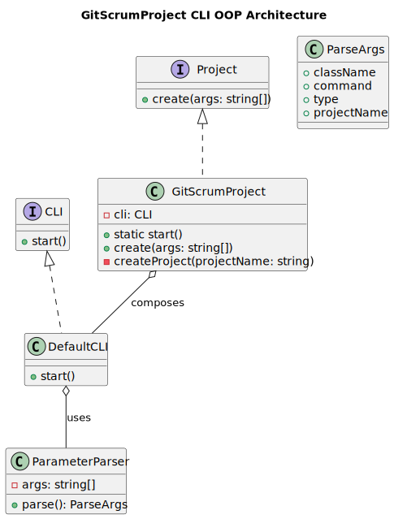
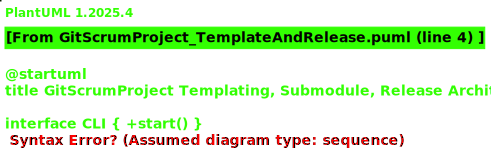

# Task 1.0: Architect - GitScrumProject Templating Spec (PUML + CLI UX)

## Goal
Define the architecture and CLI contracts for creating a new GitHub repo from this project as a template, where the new repo references the application sources via a git submodule. The wrapper repo hosts Scrum/Docs/CI and runs on top of the submodule sources.

## Status
- [ ] Planned
- [ ] In Progress
  - [ ] refinement
  - [ ] implementing
  - [ ] testing
- [ ] QA Review
- [ ] Done

## Deliverables
- PlantUML spec describing classes, flows, and repo relationships
- CLI contract for `GitScrumProject`
- Submodule layout and runtime overlay rules
- Recovery and Release plan outline

## Artifacts
- PUML: [src/puml/GitScrumProject_CLI_Architecture.puml](../../../src/puml/GitScrumProject_CLI_Architecture.puml)
- PUML: [src/puml/GitScrumProject_TemplateAndRelease.puml](../../../src/puml/GitScrumProject_TemplateAndRelease.puml)
- SVG: [src/puml/GitScrumProject_CLI_Architecture.svg](../../../src/puml/GitScrumProject_CLI_Architecture.svg)
- SVG: [src/puml/GitScrumProject_TemplateAndRelease.svg](../../../src/puml/GitScrumProject_TemplateAndRelease.svg)

### Embedded Diagrams

## CLI Contract (positional only)
- `GitScrumProject createTemplateRepo <org> <newRepo> <sourceRepoUrl> <submodulePath>`
  - Creates GitHub repo `<org>/<newRepo>` (private/public selectable via env), clones template from current project, removes `.git`, inits new repo, adds remote, commits scaffold.
  - Adds submodule at `<submodulePath>` pointing to `<sourceRepoUrl>` pinned to default branch.
  - Generates `.github/workflows/ci.yml`, `README.md` sections, and `recovery.md` boilerplate.
- `GitScrumProject linkSource <submodulePath> <sourceRepoUrl> [branchOrRef]`
  - Adds or updates the submodule to the given ref. Writes `.gitmodules` appropriately.
- `GitScrumProject overlayRun <entryClass> <method> [...args]`
  - Executes CLI from submodule sources while using wrapper repo configs (docs, env). Ensures `ts-node --esm` with PATH prep.
- `GitScrumProject releasePlan <repoType>`
  - Prints step-by-step release plan for `wrapper` or `source` repo, including tagging, changelog, and GH release (dry-run by default).

## Submodule Layout
- Wrapper repo root includes:
  - `scrum.pmo/`, `docs/`, `README.md`, `.github/`
  - `sources/` (git submodule) -> `<sourceRepoUrl>`
- No `src/` duplication. Wrapper tools operate against `sources/` code.

## Runtime Overlay
- Shell wrappers detect project root, then delegate execution into `sources/src/...` while sourcing env and configs from wrapper.
- Keep strict TypeScript ESM; no CJS.

## PUML Scope
- Classes: `GitScrumProject`, `DefaultCLI`, `ParameterParser`, `GitHubApi` (adapter), `SubmoduleManager`, `ReleaseManager`, `RecoveryManager`.
- Sequences: create repo, link submodule, overlay run, release.

## Acceptance Criteria
- CLI spec is unambiguous and adheres to positional invocation rules
- Submodule-first layout eliminates source duplication
- Clear release/recovery story for both repos
- PUMLs compile without errors and corresponding SVGs are embedded above
- This task references all created artifact file paths

---

[Back to Planning](./planning.md)